# Relatório — Missão Marte Unifor

### **Disciplina:** Projeto e Arquitetura de Sistemas — UNIFOR

### **Grupo 07**

### **Repositório:** https://github.com/SamuelBarbosa11/Missao-Marte-Grupo7

---

## Tabela de Contribuições

| Integrante            | Matrícula | Usuário Git       | Exercícios e funcionalidades                                                                                                                                                                                                   |
| --------------------- | --------- | ----------------- | ------------------------------------------------------------------------------------------------------------------------------------------------------------------------------------------------------------------------------ |
| Samuel Miguel Barbosa | 2517428   | `SamuelBarbosa11` | **Nível 1 (Ex. 1–3):** ajuste da capacidade da nave, subclasse `Astronauta`, customização dos símbolos do mapa. **Nível 2 (Ex. 4–6):** pontuação polimórfica com `@Override`, sistema de vidas, mapa configurável pelo jogador |
| João Gabriel Rinaldi  | 2510365   | `JgRM0`           | **Nível 3 (Ex. 7–9):** classe `Inimigo` com movimentação aleatória, enum `Dificuldade`, `ranking.json` expandido com data/hora, resgatados e nível. **Correções:** limites do mapa e compilação em JDK 17                      |
| Rafael Dantas         | 2517979   | `r-dantas9`       | **Nível 4 (Ex. 10):** plataforma de pouso em (0,0), menu principal e reset do ranking                                                                                                                                          |

---

## Decisões de projeto

**1. Hierarquia `Obstaculo`.** `Asteroide` e `Inimigo` compartilham posição, tipo e
regra de colisão numa classe base concreta, espelhando a hierarquia que o projeto já
tinha em `Passageiro` → `Professor`/`Engenheiro`/`Astronauta`. O `Inimigo` sobrescreve
apenas `isMovel()`; o método `mover()`, definido na classe base, consulta esse método —
ou seja, **a classe mãe executa código da filha**. Isso mantém `Asteroide` reduzido a um
construtor e concentra a colisão num único laço em `Missao`.

**2. Ajuste nos valores das dificuldades.** A tabela sugerida no tutorial foi corrigida.
Nela, o nível Fácil tinha 5 asteroides contra 3 do Normal e exigia 5 passageiros numa
nave de capacidade 4 — o que tornava o nível Fácil **impossível de concluir**, já que o
quinto embarque sempre falhava. Os valores adotados crescem junto com a dificuldade, e a
capacidade da nave acompanha o número de passageiros do nível.

| Nível   | Passageiros | Asteroides | Inimigos | Pontos iniciais |
| ------- | ----------- | ---------- | -------- | --------------- |
| FACIL   | 3           | 2          | 1        | 30              |
| MEDIO   | 4           | 3          | 1        | 20              |
| DIFICIL | 5           | 5          | 2        | 15              |

**3. Ranking por piloto e por dificuldade.** Cada piloto tem um único registro em cada
nível, guardando sua melhor partida. Na versão anterior o ranking apenas acrescentava
entradas, de modo que um mesmo jogador podia ocupar as cinco posições e expulsar os
demais integrantes da lista.

**4. Compatibilidade do `ranking.json`.** As chaves `name` e `score` foram preservadas no
JSON, e os campos novos foram acrescentados ao lado delas. Arquivos gravados antes do
Ex. 9 continuam carregando; registros sem o campo de dificuldade são lidos como `MEDIO`,
que é o nível equivalente ao jogo anterior (20 pontos iniciais e 4 passageiros).

**5. Obstáculos não ocupam a base (0,0).** Como a nave é reposicionada em (0,0) ao
colidir, um inimigo que caminhasse até a origem faria a nave colidir repetidamente sem
poder reagir. O obstáculo recusa movimento para essa coordenada.

**Limitação conhecida:** o campo "passageiros resgatados" registra sempre o total do
nível, porque somente partidas vencidas entram no ranking, e vencer exige embarcar todos.

---

## Evidências de Execução

> As capturas devem ser feitas executando `run start` na raiz do projeto. Executar pelo
> botão Run da IDE não aplica `chcp 65001` e os ícones do mapa saem como `?`.

## **Nível 1: Refatoração e Tipos (Exercícios 1 a 3)**

### • Ajuste de Capacidade:

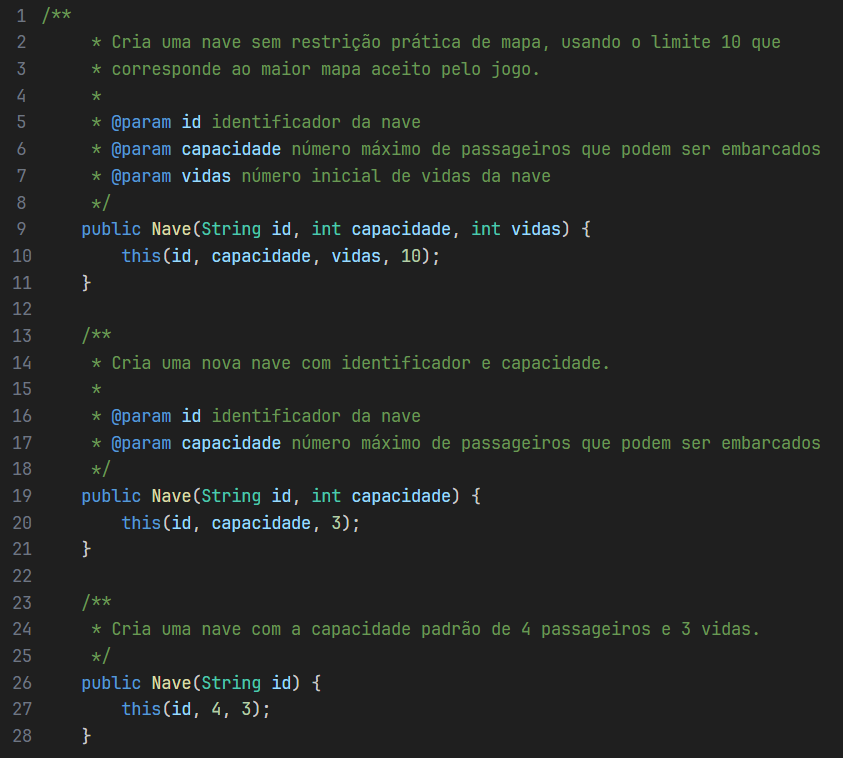

### • Nova Subclasse de Passageiro (Astronauta):

.png>)

### • Customização Visual:

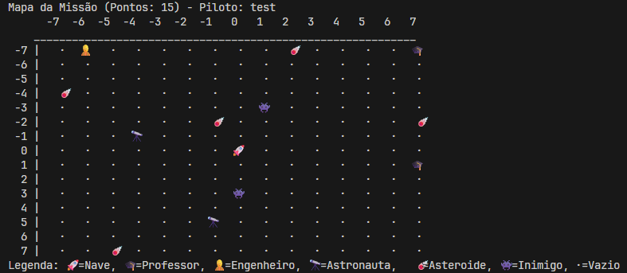

## **Nível 2: Mecânicas de Jogo e POO (Exercícios 4 a 6)**

### • Pontuação Polimórfica:

Passageiro.java

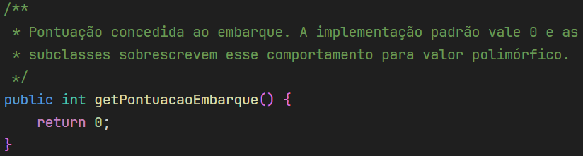

Professor.java

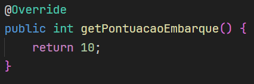

Engenheiro.java

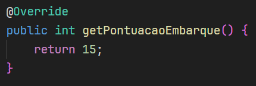

Astronauta.java

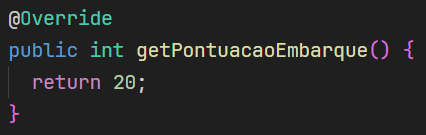

**Antes** de pegar o engenheiro:

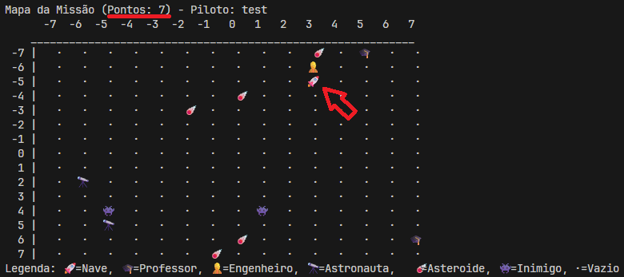

**Depois** de pegar o engenheiro:

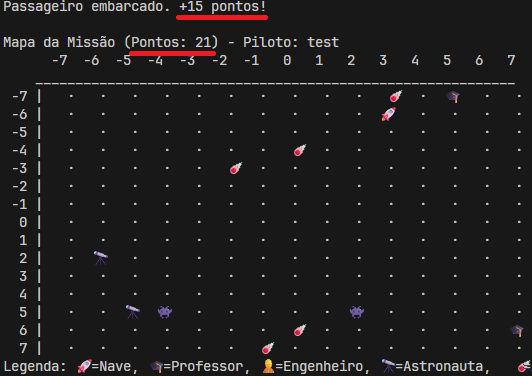

### • Sistema de Vidas na Nave:

O jogo começa com a nave tendo 3 vidas

**Antes** da colisão:

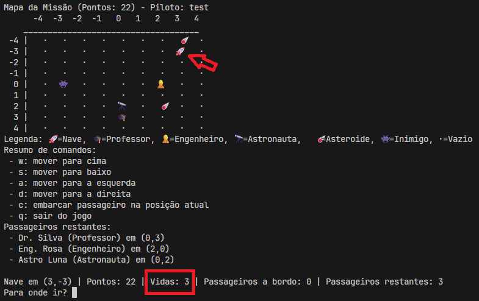

**Depois** da colisão:

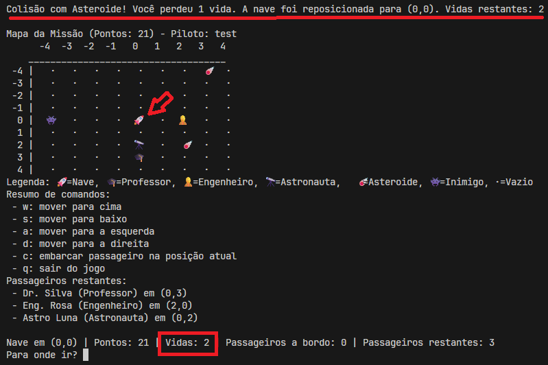

Exemplo de **Morte**:

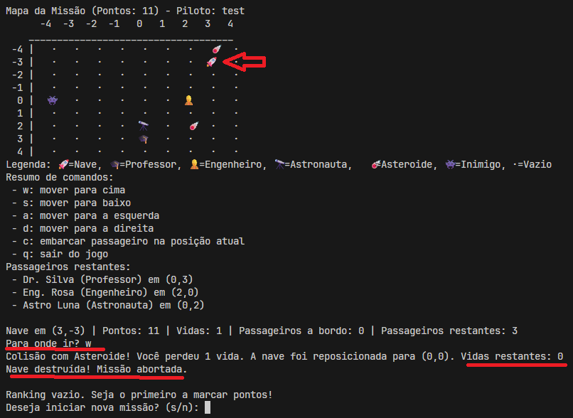

### • Mapa Configurável:

configuração pré-jogo

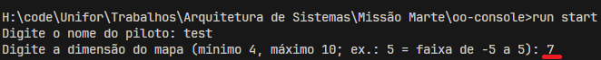

resultado:

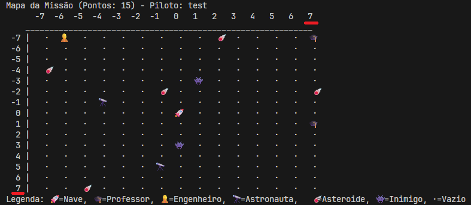

## **Nível 3: Comportamentos Avançados e Persistência (Exercícios 7 a 9)**

### • Inimigos Dinâmicos com IA Simples:

Inicio:

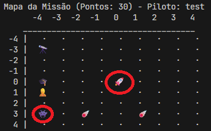

Turno 1:

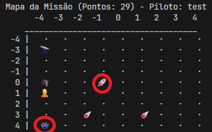

Turno 3:

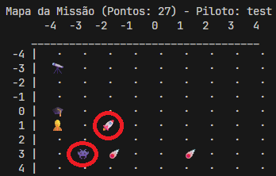

### • Menu de Dificuldades (Enum):

Configuração pré jogo:

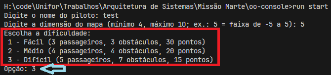

Resultado:

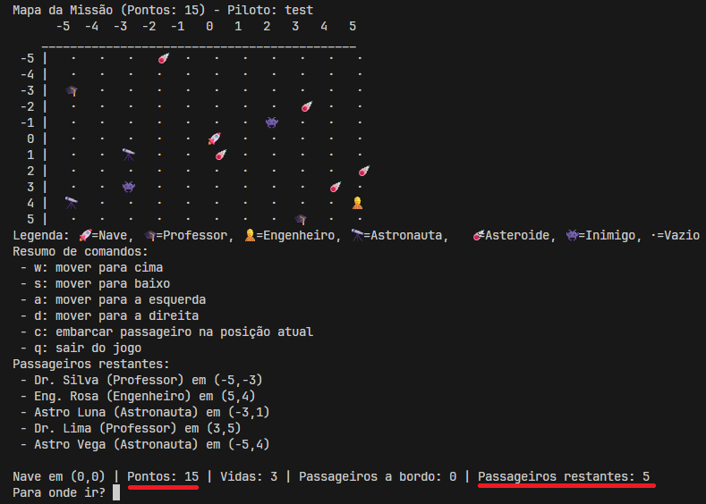

### • Persistência Expandida:

Ranking agora salva data/hora, passageiros resgatados e nível de dificuldade:

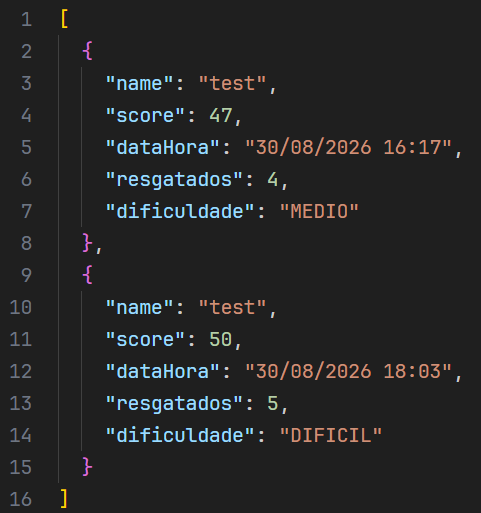

## **Nível 4: Desafio Final (Exercício 10)**

### • Plataforma de Pouso (0, 0):

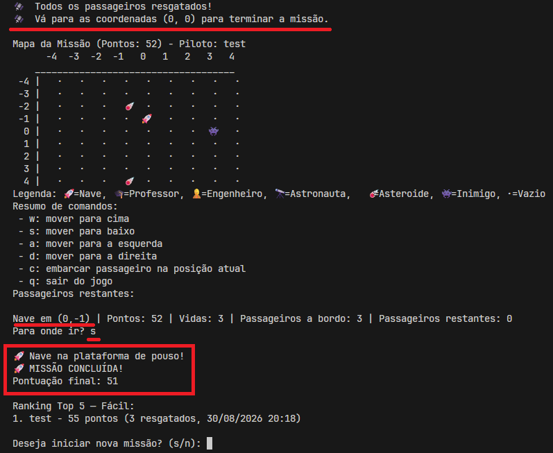

### • Menu Principal e Reset:

