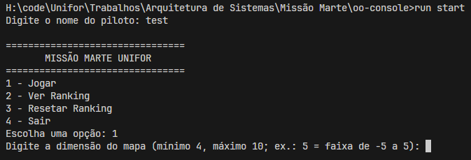
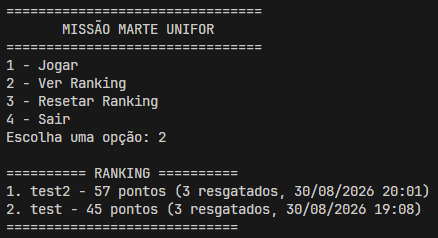
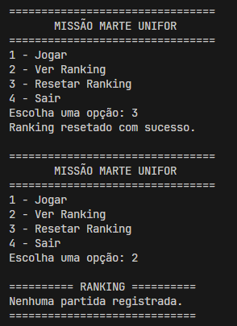
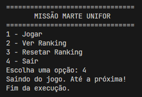

# Relatório — Missão Marte Unifor

### Disciplina: Projeto e Arquitetura de Sistemas — UNIFOR
### Grupo 07
### Repositório: https://github.com/SamuelBarbosa11/Missao-Marte-Grupo7

---

## 1. Tabela de Contribuições

| Integrante | Matrícula | Usuário Git | Exercícios e funcionalidades |
| --- | --- | --- | --- |
| Samuel Miguel Barbosa | 2517428 | SamuelBarbosa11 | Nível 1 e Nível 2: ajuste da capacidade da nave, subclasse Astronauta, customização de símbolos do mapa, pontuação polimórfica, sistema de vidas e mapa configurável. |
| João Gabriel Rinaldi | 2510365 | JgRM0 | Nível 3: inimigos dinâmicos, enum Dificuldade, persistência expandida do ranking com data/hora, passageiros resgatados e nível; além de ajustes de limite do mapa e compatibilidade com JDK 17. |
| Rafael Dantas | 2517979 | r-dantas9 | Nível 4: plataforma de pouso em (0,0), menu principal e reset do ranking. |

---

## 2. Objetivos e Implementações do Projeto

A equipe estendeu a base do jogo console “Missão Marte Unifor” para atender aos requisitos dos Níveis 1 a 4 do roteiro da disciplina, aplicando conceitos de herança, polimorfismo, encapsulamento e persistência em JSON.

As principais implementações foram:

- Nível 1: ajuste da capacidade da nave, criação da subclasse Astronauta e customização visual do mapa.
- Nível 2: pontuação polimórfica por tipo de passageiro, sistema de vidas da nave e configuração dinâmica do tamanho do mapa.
- Nível 3: inimigos com movimentação automática, menu de dificuldades com enum, e expansão do ranking para registrar data/hora, passageiros resgatados e nível da partida.
- Nível 4: plataforma de pouso na coordenada (0,0), menu interativo e opção de reset do ranking.

---

## 3. Evidências de Execução

> As imagens abaixo foram obtidas em execução do jogo pela linha de comando, conforme recomendado no projeto, usando run start na raiz do repositório para manter a correta renderização dos símbolos no terminal.

## **Nível 1: Refatoração e Tipos (Exercícios 1 a 3)**

### • Ajuste de Capacidade:

### • Nova Subclasse de Passageiro (Astronauta):

.png>)

### • Customização Visual:

## **Nível 2: Mecânicas de Jogo e POO (Exercícios 4 a 6)**

### • Pontuação Polimórfica:

Passageiro.java

Professor.java

Engenheiro.java

Astronauta.java

**Antes** de pegar o engenheiro:

**Depois** de pegar o engenheiro:

### • Sistema de Vidas na Nave:

O jogo começa com a nave tendo 3 vidas

**Antes** da colisão:

**Depois** da colisão:

Exemplo de **Morte**:

### • Mapa Configurável:

configuração pré-jogo

resultado:

## **Nível 3: Comportamentos Avançados e Persistência (Exercícios 7 a 9)**

### • Inimigos Dinâmicos com IA Simples:

Inicio:

Turno 1:

Turno 3:

### • Menu de Dificuldades (Enum):

Configuração pré jogo:

Resultado:

### • Persistência Expandida:

Ranking agora salva data/hora, passageiros resgatados e nível de dificuldade:

## **Nível 4: Desafio Final (Exercício 10)**

### • Plataforma de Pouso (0, 0):

### • Menu Principal e Reset:

- Opção 1:

- Opção 2:

- Opção 3:

- Opção 4:

---

## 4. Considerações Finais

O projeto foi concluído com a integração dos requisitos avaliativos em um único sistema funcional em Java, mantendo a organização do código em pacote e demonstrando o uso prático de conceitos de POO, manipulação de arquivos JSON e interação em console. A implementação atende ao escopo proposto para a entrega da atividade prática avaliativa.
